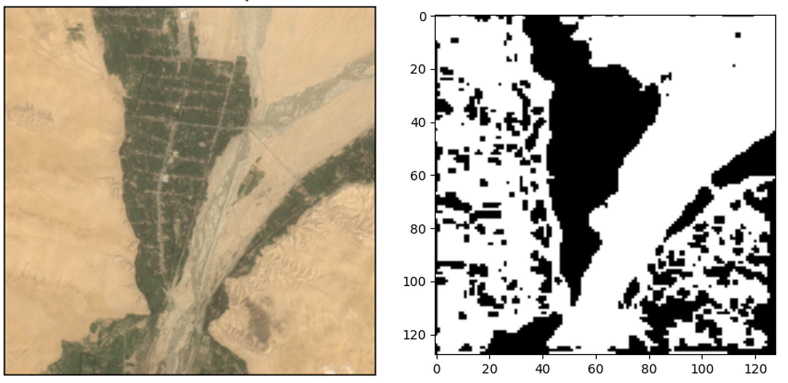
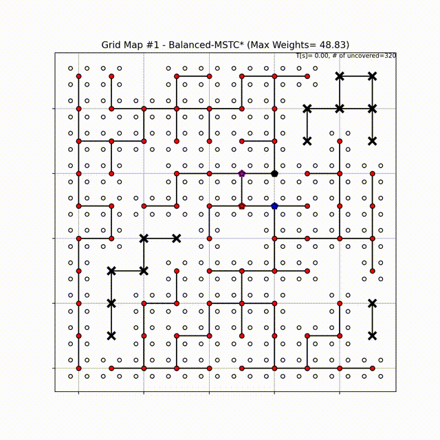

# MSTC-Star
> code with ICRA'21 paper - MSTC*: Multi-robot Coverage Path Planning under Physical Constraints. [[paper]](https://reso1.github.io/blog/assets/docs/papers/ICRA21-MSTC_Star.pdf), [[video]](https://vimeo.com/535512748).

## Description
- **Terrain filtering**: implementations of terrain-slope based map filtering, terrain segmentation network, as well as map fusing and graph generating.
    > pre-trained model of terrain segmentation network can be downloaded in [[here]](https://drive.google.com/file/d/1RBGVuM3gpWGIcRdU5eVjSI33HmsklTDI/view?usp=sharing)

- **Multi-robot coverage path planning (mCPP)**: implementations of *Naive-MSTC*, Balanced-MSTC*, MFC, MSTC(w/ and w/o backtracking)*, see files in *./mcpp* for details.

## Requirments
- python 3.6 +
- matplotlib
- numpy
- scipy
- skimage
- pytorch (tested on 1.7.0)
- opencv-python (tested on v.4.4.0.46)
- rasterio (tested on v.1.1.8)
- networkx (tested on v.2.5)
  
## Demos

- terrain filtering

- mCPP on artificial terrain

- mCPP on real terrain

